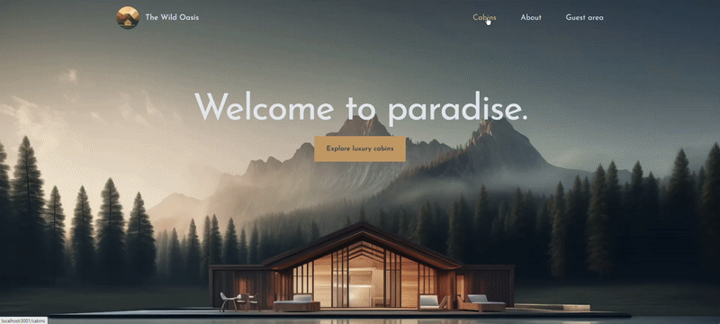

# The Wild Oasis Website

<div align="center">
   <a href="heliohdd-wild-oasis-website.vercel.app" alt="The Wild Oasis">
   
   <a>
</div>

This is a [`Next.js`](https://nextjs.org/) project bootstrapped with [`create-next-app`](https://github.com/vercel/next.js/tree/canary/packages/create-next-app).

## Getting Started

Run each of the lines above in a git bash terminal:

1. Clone the repository

```sh
git clone https://github.com/heliohdd/the-wild-oasis-website.git
```

2. Change to the project folder

```sh
cd the-wild-oasis-website
```

3. Install NPM packages dependencies

```sh
npm install
```

4. Now run the application

```sh
npm run dev
```

And then open [http://localhost:3000](http://localhost:3000) with your browser to see the result.

## Introduction

<b>"The Wild Oasis"</b> is a small boutique <b>hotel</b> with 8 luxurious wooden cabin.

This is the <b>"The Wild Oasis Website"</b> wich is a <b>customer-facing</b> website to be used by the users in a personal account, where customers will be able to book stays, using the same API as the used by <b>["The Wild Oasis"](https://github.com/heliohdd/the-wild-oasis?tab=readme-ov-file#readme)</b> internal hotel manage app.

## Project Requirements From the Business

1. Users of the app are potential guests and actual guests
1. Guests should be able to learn all about the Wild Oasis Hotel
1. Guests should be able to get information about each cabin and see booked dates
1. Guests should be able to filter cabins by their maximum guest capacity
1. Guests should be able to reserve a cabin for a certain date range
1. Reservations are not paid online. Payments will be made at the property upon arrival. Therefore, new reservations should be set to "unconfirmed" (booked but not yet checked in)
1. Guests should be able to view all their past and future reservations
1. Guests should be able to update or delete a reservation
1. Guests need to sign up and log in before they can reserve a cabin and perform any operation
1. On sign up, each guest should get a profile in the DB
1. Guests should be able to set and update basic data about their profile to make check-in at the hotel faster

<p align="right">(<a href="#readme-top">back to top</a>)</p>

## Technology & Tools

<!-- <p align="center">
   
   
   
   
   
   
</p> -->

- NEXT.js
- Context API
- Supabase
- Tailwindcss

## Structure of the application

<!-- This application is used internally as tool inside a company, that are entirely hidden behind a login it was used to build a Single-Page-Application and this application is composed of 8 pages that represents 7 features categories as listed below: -->

1. Homepage
1. About Page
1. Cabin overview
1. Cabin detail
1. Login
1. Reservation list
1. Edit reservation
1. Update profile

```

```
